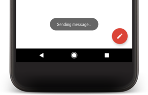

# Android 源码分析 —— 从 Toast 出发



（图 from Android Developers）

Toast 是 Android 开发里较常用的一个类了，有时候用它给用户弹提示信息和界面反馈，有时候用它来作为辅助调试的手段。用得多了，自然想对其表层之下的运行机制有所了解，所以在此将它选为我的第一个 RTFSC Roots。

本篇采用的记录方式是先对它有个整体的了解，然后提出一些问题，再通过阅读源码，对问题进行一一解读而后得出答案。

本文使用的工具与源码为：Chrome、插件 insight.io、GitHub 项目 [aosp-mirror/platform_frameworks_base][3]

## Toast 印象

首先我们从 Toast 类的 [官方文档](1) 和 [API 指南](2) 中可以得出它具备如下特性：

1. Toast 不是 View，它用于帮助创建并展示包含一条小消息的 View；

2. 它的设计理念是尽量不惹眼，但又能展示想让用户看到的信息；

3. 被展示时，浮在应用界面之上；

4. 永远不会获取到焦点；

5. 大小取决于消息的长度；

6. 超时后会自动消失；

7. 可以自定义显示在屏幕上的位置（默认左右居中显示在靠近屏幕底部的位置）；

8. 可以使用自定义布局，也只有在自定义布局的时候才需要直接调用 Toast 的构造方法，其它时候都是使用 makeText 方法来创建 Toast；

9. Toast 弹出后当前 Activity 会保持可见性和可交互性；

10. 使用 cancel 方法可以立即将已显示的 Toast 关闭，让未显示的 Toast 不再显示；

11. Toast 也算是一个「通知」，如果弹出状态消息后期望得到用户响应，应该使用 Notification。

不知道你看到这个列表，是否学到了新知识或者明确了以前不确定的东西，反正我在整理列表的时候是有的。

## 提出问题

根据以上特性，再结合平时对 Toast 的使用，提出如下问题来继续本次源码分析之旅（大致由易到难排列，后文用 小 demo 或者源码分析来解答）：

1. Toast 的超时时间具体是多少？

2. 能不能弹一个时间超长的 Toast？

3. Toast 能不能在非 UI 线程调用？

4. 应用在后台时能不能 Toast？

5. Toast 数量有没有限制？

6. `Toast.makeText(…).show()` 具体都做了些什么？

## 解答问题

### Toast 的超时时间

用这样的一个问题开始「Android 源码分析」，真的好怕被打死……大部分人都会嗤之以鼻：Are you kidding me? So easy. 各位大佬们稍安勿躁，阅读大型源码不是个容易的活，让我们从最简单的开始，一点一点建立自信，将这项伟大的事业进行下去。

面对这个问题，我的第一反应是去查 Toast.LENGTH_LONG 和 Toast.LENGTH_SHORT 的值，毕竟平时都是用这两个值来控制显示长/短 Toast 的。

文件 [platform_frameworks_base/core/java/android/widget/Toast.java][4] 中能看到它们俩的定义是这样的：

```java
/**
 * Show the view or text notification for a short period of time.  This time
 * could be user-definable.  This is the default.
 * @see #setDuration
 */
public static final int LENGTH_SHORT = 0;

/**
 * Show the view or text notification for a long period of time.  This time
 * could be user-definable.
 * @see #setDuration
 */
public static final int LENGTH_LONG = 1;
```

啊哦~原来它们只是两个 flag，并非确切的时间值。

既然是 flag，那自然就会有根据不同的 flag 来设置不同的具体值的地方，于是使用 insight.io 点击 `LENGTH_SHORT` 的定义搜索一波 `Toast.LENGTH_SHORT` 的引用，在 [aosp-mirror/platform_frameworks_base][3] 里一共有 50 处引用，但都是调用 `Toast.makeText(...)` 时出现的。

继续搜索 `Toast.LENGTH_LONG` 的引用，在 [aosp-mirror/platform_frameworks_base][3] 中共出现 42 次，其中有我们想找的：

文件 [platform_frameworks_base/services/core/java/com/android/server/notification/NotificationManagerService.java][5] 里

```java
long delay = r.duration == Toast.LENGTH_LONG ? LONG_DELAY : SHORT_DELAY;
```

在同一文件里能找到 `LONG_DELAY` 与 `SHORT_DELAY` 的定义：

```java
static final int LONG_DELAY = PhoneWindowManager.TOAST_WINDOW_TIMEOUT;
static final int SHORT_DELAY = 2000; // 2 seconds
```

点击查看 `PhoneWindowManager.TOAST_WINDOW_TIMEOUT` 的定义：

文件 [platform_frameworks_base/services/core/java/com/android/server/policy/PhoneWindowManager.java][6]

```java
/** Amount of time (in milliseconds) a toast window can be shown. */
public static final int TOAST_WINDOW_TIMEOUT = 3500; // 3.5 seconds
```

于是，我们可以得出 **结论：Toast 的长/短超时时间分别为 3.5 秒和 2 秒。**

*Tips: 也可以通过分析代码里的逻辑，一层一层追踪用到 LENGTH_SHORT 和 LENGTH_LONG 的地方，最终得出结论，而这里是根据一些合理推断来简化追踪过程，更快达到目标，这在一些场景下是可取和必要的。*

### 能不能弹一个时间超长的 Toast？

注：这里探讨的是能否直接通过 Toast 提供的公开 API 做到，网络上能搜索到的使用 Timer、反射、自定义等方式达到弹出一个超长时间 Toast 目的的方法不在讨论范围内。

我们在 Toast 类的源码里看一下跟设置时长相关的代码：

文件 [platform_frameworks_base/core/java/android/widget/Toast.java][4]

```java
...

    /** @hide */
    @IntDef({LENGTH_SHORT, LENGTH_LONG})
    @Retention(RetentionPolicy.SOURCE)
    public @interface Duration {}

...

    /**
     * Set how long to show the view for.
     * @see #LENGTH_SHORT
     * @see #LENGTH_LONG
     */
    public void setDuration(@Duration int duration) {
        mDuration = duration;
        mTN.mDuration = duration;
    }

...

    /**
     * Make a standard toast that just contains a text view.
     *
     * @param context  The context to use.  Usually your {@link android.app.Application}
     *                 or {@link android.app.Activity} object.
     * @param text     The text to show.  Can be formatted text.
     * @param duration How long to display the message.  Either {@link #LENGTH_SHORT} or
     *                 {@link #LENGTH_LONG}
     *
     */
    public static Toast makeText(Context context, CharSequence text, @Duration int duration) {
        return makeText(context, null, text, duration);
    }

...
```

其实从上面 `setDuration` 和 `makeText` 的注释已经可以看出，duration 只能取值 LENGTH_SHORT 和 LENGTH_LONG，除了注释之外，还使用了 `@Duration` 注解来保证此事。`Duration` 自身使用了 `@IntDef` 注解，它用于限制可以取的值。

文件 [platform_frameworks_base/core/java/android/annotation/IntDef.java][7]

```java
/**
 * Denotes that the annotated element of integer type, represents
 * a logical type and that its value should be one of the explicitly
 * named constants. If the {@link #flag()} attribute is set to true,
 * multiple constants can be combined.
 * ...
 */
```

不信邪的我们可以快速在一个 Demo Android 工程里写一句这样的代码试试：

```java
Toast.makeText(this, "Hello", 2);
```

Android Studio 首先就不会同意，警告你 `Must be one of: Toast.LENGTH_SHORT, Toast.LENGTH_LONG`，但实际这段代码是可以通过编译的，因为 `Duration` 注解的 `Retention` 为 `RetentionPolicy.SOURCE`，我的理解是该注解主要能用于 IDE 的智能提示警告，编译期就被丢掉了。

但即使 duration 能传入 LENGTH_SHORT 和 LENGTH_LONG 以外的值，也并没有什么卵用，别忘了这里设置的只是一个 flag，真正计算的时候是 `long delay = r.duration == Toast.LENGTH_LONG ? LONG_DELAY : SHORT_DELAY;`，即 duration 为 LENGTH_LONG 时时长为 3.5 秒，其它情况都是 2 秒。

所以我们可以得出 **结论：无法通过 Toast 提供的公开 API 直接弹出超长时间的 Toast。**（如节首所述，可以通过一些其它方式实现类似的效果）

### Toast 能不能在非 UI 线程调用？

[1]: https://developer.android.com/reference/android/widget/Toast.html
[2]: https://developer.android.com/guide/topics/ui/notifiers/toasts.html
[3]: https://github.com/aosp-mirror/platform_frameworks_base
[4]: https://github.com/aosp-mirror/platform_frameworks_base/blob/master/core/java/android/widget/Toast.java
[5]: https://github.com/aosp-mirror/platform_frameworks_base/blob/master/services/core/java/com/android/server/notification/NotificationManagerService.java
[6]: https://github.com/aosp-mirror/platform_frameworks_base/blob/master/services/core/java/com/android/server/policy/PhoneWindowManager.java
[7]: https://github.com/aosp-mirror/platform_frameworks_base/blob/master/core/java/android/annotation/IntDef.java
